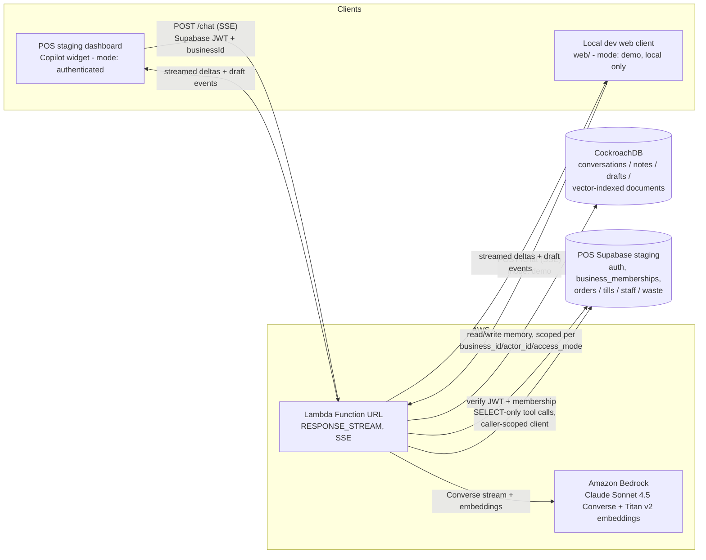

# Cafe Copilot

A plain-language AI assistant for small cafe owners. Most POS software gives an owner dashboards full of numbers. Cafe Copilot lets them ask instead: "How was yesterday?", "Why was the drawer short?", "Have we had problems with refunds lately?" — and get an honest answer, computed live from the cafe's real till data. It can also draft things for a human to review (a purchase order), but it never writes anything back to the point-of-sale system itself.

Cafe Copilot is a companion to Project POS (a lightweight POS + Kitchen Display System for small food businesses). It reads that system's data read-only and adds a conversational layer on top, embedded directly in the POS manager dashboard.

Built for the CockroachDB x AWS AI Hackathon.

## Problem

A non-technical cafe owner does not want to learn a reporting dashboard to answer questions they already know how to ask out loud — "how did we do yesterday", "why was the till short", "who's my best staff member this month". Answering those questions correctly requires querying several tables (orders, till sessions, adjustments, waste logs) and reasoning across them without inventing numbers. Cafe Copilot does that querying and reasoning, in plain language, and refuses to guess when the data does not support an answer.

## What it does

- Answers questions about a specific day's sales, cash reconciliation, and order mix.
- Compares staff performance and cash accountability over a date range.
- Surfaces waste and comp log entries, grouped by reason and by item.
- Searches its own memory of past daily summaries by meaning, not just exact dates, so a vague question like "have we had problems with refunds lately" still finds the right day.
- Remembers business notes the owner asks it to keep ("we switch to the winter menu in November") and lists them back on request.
- Drafts a purchase order for the owner to review. Drafts are saved, never submitted.
- States plainly when a date has no recorded activity instead of inventing a figure.

## Demo

The supported demo surface is the Copilot widget embedded in the Project POS staging dashboard, running in authenticated mode against a real signed-in session.

1. Open the POS staging dashboard: `https://phase-8-auth.project-pos.pages.dev`.
2. Sign in with the dedicated staging demo-owner credentials supplied privately by the project owner.
3. Enter the staging demo-owner PIN when prompted.
4. Open the manager dashboard.
5. Click the floating Copilot button and ask a question.

The account is restricted by Row-Level Security to the fictional "Harbour & Bean Demo Café" only. Credentials are deliberately not committed to this public repository. Judges with access can browse the dashboard reports beside the chat to verify the raw data behind an answer.

The seeded demo data covers 2026-06-22 through 2026-07-12. Questions about dates outside that range correctly come back as "no activity recorded" rather than an invented figure.

Questions verified end to end against live Amazon Bedrock, the POS staging project, and CockroachDB — with the actual streamed answers:

- "Why was the drawer short on July 4th 2026?" — LKR 4,800 short; expected LKR 34,850 vs counted LKR 30,050; 18 orders, LKR 32,400 gross.
- "Have we had any problems with refunds lately?" — retrieves the 8 July spike (4 refunds totalling LKR 2,800) via vector search, with no date supplied by the user.
- "Who were our best staff between July 1st and July 12th 2026?" — Ruwan Jayasinghe, LKR 174,250 over 102 orders; Nimal Silva, LKR 158,700 over 94 orders with a LKR 4,975 net short.
- "How was yesterday?" — correctly answers that there is no activity recorded for that date rather than inventing figures, when the date falls outside the seeded range.

The standalone app in `web/` is a local development client (`npm run dev:web`), useful for iterating on the chat UI without the POS dashboard running. It always sends `mode: "demo"` and is not a hosted public demo — see [Deployment](#deployment).

## Architecture



The agent loop (`agent/handler.mjs` + `agent/tools.mjs`) sends the conversation to Bedrock, streams text as it arrives, and — when the model requests a tool — executes it and feeds the result back: `get_day_summary`, `get_staff_performance`, and `get_waste_log` run live, read-only queries against the POS staging project; `search_memory` embeds the query and vector-searches CockroachDB; `save_note` / `list_notes` / `draft_purchase_order` read and write CockroachDB directly. The POS stays the single source of truth for every number the agent states — CockroachDB is for context and retrieval, never for arithmetic.

## How CockroachDB is used

Every part of what the agent "remembers" — not just chat history, but the business context it draws on to answer a question — lives in CockroachDB, scoped by a composite `(business_id, actor_id, access_mode)` principal on every table:

- **Conversations and messages** are persisted on every turn (`memory/store.mjs`). Reading or appending to a conversation requires an exact match on all three principal fields, enforced with `INSERT ... SELECT` guards so ownership cannot be raced.
- **Business notes** (`save_note` / `list_notes`) are durable rows in the `notes` table.
- **Purchase-order drafts** are saved to the `drafts` table as JSONB, returned to the UI as a reviewable card, and never auto-submitted anywhere.
- **Daily summaries** — one embedded narrative + key-figures document per day the pos-sync summariser has processed — live in the `documents` table with a real `CREATE VECTOR INDEX`, so `search_memory` can retrieve relevant history by meaning, not just exact dates. The seeded demo cafe currently has 21 such documents, covering 2026-06-22 through 2026-07-12.

Schema (`memory/schema.sql`):

```sql
CREATE TABLE IF NOT EXISTS documents (
  id UUID PRIMARY KEY DEFAULT gen_random_uuid(),
  business_id TEXT NOT NULL,
  doc_type TEXT NOT NULL,
  doc_date DATE,
  content TEXT NOT NULL,
  metadata JSONB NOT NULL DEFAULT '{}',
  embedding VECTOR(__EMBEDDING_DIM__) NOT NULL,
  created_at TIMESTAMPTZ NOT NULL DEFAULT now()
);

CREATE VECTOR INDEX IF NOT EXISTS documents_embedding_idx ON documents (embedding);
```

Cosine search behind `search_memory` (`memory/store.mjs`):

```sql
SELECT id, doc_type, doc_date, content, metadata, embedding <=> $2 AS distance
  FROM documents
 WHERE business_id = $1
 ORDER BY embedding <=> $2
 LIMIT $3
```

### The two required CockroachDB tools

1. **Distributed Vector Indexing** — semantic recall over the daily summaries. Titan Text Embeddings v2 embeds each summary and every incoming `search_memory` query; CockroachDB's native `VECTOR` column and `CREATE VECTOR INDEX` do the nearest-neighbor search with the cosine operator (`<=>`) — no separate vector database, no reindexing pipeline. This is the same mechanism the live demo uses when someone asks "have we had problems with refunds lately?" — the agent has no date to search on, so it searches memory by meaning and gets back the flagged refund-spike summary.
2. **CockroachDB Agent Skills Repo** — the official `cockroachdb-sql` Agent Skill was applied
   during the release audit to the memory schema, migrations, and query layer. Its distributed
   SQL rules verified explicit UUID primary keys, fixed-width vectors, tenant predicates, atomic
   conflict handling, and bounded retrieval; the resulting evidence and follow-ups are recorded
   in [`docs/COCKROACHDB_SKILL_AUDIT.md`](docs/COCKROACHDB_SKILL_AUDIT.md).

## AWS services used

- **Amazon Bedrock** runs the model: Claude Sonnet 4.5 via the Converse Stream API for the chat/tool loop, and Titan Text Embeddings v2 for the vectors behind `search_memory`. Model and embedding-model ids are discovered and pinned per-account by `npm run find-model` / `npm run find-embedding-model` rather than hardcoded, since model availability differs per AWS account and region.
- **AWS Lambda** hosts the agent backend (`nodejs22.x`, 512 MB, 55 s timeout, reserved concurrency 2) behind a public Function URL in `RESPONSE_STREAM` invoke mode, streaming Server-Sent Events. No static AWS credentials exist in the function's environment — Bedrock access comes solely from its IAM execution role, scoped to `bedrock:InvokeModel*` plus its own CloudWatch Logs group.

## Security posture

- **Authenticated, per-business, no elevation.** The POS-embedded widget sends `mode: "authenticated"` with the signed-in user's Supabase JWT and an explicit `businessId`. The backend (`agent/auth-context.mjs`) verifies the JWT with Supabase, then requires an active `owner` or `manager` row in `business_memberships` for that exact business before any data is touched. Every POS-reading tool then runs through a request-scoped Supabase client built from the caller's own JWT (`agent/pos-client.mjs`), so row-level security applies to the caller — the backend never elevates its own privileges. Verified live today: no token returns 401, an invalid token returns 401, a disallowed browser origin returns 403, a missing or invalid `mode` returns 400, an oversized request body returns 413.
- **Staging-only, enforced in code.** `assertStagingUrl` in `agent/pos-client.mjs` hard-refuses any Supabase URL that is not exactly the POS staging project — wrong hostname, non-HTTPS, embedded credentials, or a non-default port all abort loudly rather than silently falling through.
- **Memory tenancy.** Every CockroachDB statement is parameterized and predicated on the composite `(business_id, actor_id, access_mode)` principal, using `INSERT ... SELECT` guards so a conversation, note, or draft cannot be raced into existing under the wrong owner.
- **Numbers only come from live tool results**, never estimated or recalled from outside a tool call in the current conversation — enforced in the system prompt. Refunds and voids in `get_staff_performance` are attributed to whichever staff member approved the adjustment, not framed as something they personally rang up. Anything a tool returns is marked as business data the model must never treat as a command, even if its text looks instruction-shaped.
- **No writes to the POS, ever.** The agent's only "write" capabilities, `save_note` and `draft_purchase_order`, land in CockroachDB, not the POS. Every POS-reading tool performs `SELECT`-only queries.
- **Guardrails in code:** reserved concurrency, a per-IP rate limit window, a per-request deadline (504), a max body size (413), a max input length, a Bedrock max-output-tokens cap, and a 6-iteration cap on the agent tool loop. The rate limiter is per warm Lambda instance, not global — see [Limitations](#limitations).

## Local setup (from a fresh clone)

Requires Node 20+ and npm.

Install dependencies from the repo root (npm workspaces cover `web/`, `agent/`, and `memory/`):

```bash
npm install
```

Create `.env.local` at the repo root (gitignored, never committed). See `docs/CONTRACTS.md` for what each variable is and where its value comes from:

- `CRDB_CONNECTION_STRING` — your CockroachDB cluster connection string.
- `AWS_REGION` — region for the local Bedrock client and deployment tooling; AWS auth follows the SDK's default credential provider chain.
- `BEDROCK_MODEL_ID` — generate with `npm run find-model`, or set by hand.
- `BEDROCK_EMBEDDING_MODEL_ID`, `EMBEDDING_DIM` — generate with `npm run find-embedding-model`.
- `POS_SUPABASE_URL`, `POS_SUPABASE_ANON_KEY` — the POS staging project (the agent refuses to run against any other project).
- `DEMO_BUSINESS_ID` — the seeded demo cafe's business id.
- `DEMO_OWNER_EMAIL` / `DEMO_OWNER_PASSWORD` — required for local demo mode, seeding,
  backfilling, and the authenticated staging smoke; there is no committed fallback.
- `DEMO_OWNER_PIN`, `DEMO_MANAGER_PIN`, `DEMO_STAFF_PIN_1`, `DEMO_STAFF_PIN_2` — four distinct
  four-digit values required only when creating or recreating the fictional staging café.
  Keep them in `.env.local`; do not put their values in documentation or commits.

Apply the CockroachDB schema (idempotent, safe to re-run):

```bash
npm run memory:migrate
```

Seed a demo cafe on POS staging (owned by a separate workspace; install its dependencies first):

```bash
cd demo-seed && npm install && npm run seed -- --fresh && cd ..
```

Backfill the agent's memory with embedded daily summaries for the seeded date range, so `search_memory` has something to retrieve (idempotent, safe to re-run):

```bash
npm run agent:backfill
```

Start the backend and frontend in separate terminals:

```bash
npm run dev:agent
```

```bash
npm run dev:web
```

`dev:agent` serves `POST /chat` on `http://localhost:8787`. `dev:web` serves the chat UI on `http://localhost:5173` and proxies `/chat` to the agent. Open `http://localhost:5173` and send a message; reload the page and ask "what did I just ask you?" — the conversation continues, because CockroachDB remembers it, not the browser tab.

## Verification commands

```bash
npm test
```

```bash
npm run lint
```

```bash
npm run build
```

`npm test` runs the complete test suites across the agent, memory, and web workspaces. `npm run lint` and `npm run build` verify code quality and the production bundle.

```bash
npm run memory:verify
```

Live proof the memory layer works end to end against the real cluster: migrates, writes and reads back a conversation, embeds two texts via real Bedrock, upserts them as vector-indexed documents, vector-searches with a third embedded query, and cleans up its own rows.

## Deployment

Two independent halves: the agent runs as an AWS Lambda behind a public Function URL; the web chat UI is a static build (used locally, and optionally deployable to a static host). Redeploying either half never requires redeploying the other.

Operational detail — deploy procedure, rollback, health checks, failure playbook, cost/abuse controls, observability, and incident response — lives in `docs/RUNBOOK.md` and is kept there rather than duplicated here.

Build and deploy the agent:

```bash
npm run bundle --workspace=agent
```

```bash
npm run deploy-lambda --workspace=agent
```

`bundle` produces `agent/dist-lambda/function.zip`; `deploy-lambda` reads that pre-built zip and never bundles for you. The deploy is idempotent and uses a fencing lock (Lambda `RevisionId` compare-and-swap) so a second concurrent deploy fails closed instead of racing the first.

Lambda environment variables are set by category — connections/identity, Bedrock, browser access, and required guardrails — never with values in this README or committed anywhere. The full variable-by-variable table (name, purpose, required/optional, default) is in `docs/RUNBOOK.md` section 2. Static AWS credentials are never set as Lambda environment variables; the deployed function uses only its IAM execution role for Bedrock and logs.

## Limitations

- The seeded demo cafe has data only for 2026-06-22 through 2026-07-12; questions about dates outside that range correctly return "no activity" rather than inventing figures.
- Public demo mode (`mode: "demo"` against the deployed function) is currently disabled; the authenticated POS-embedded widget is the supported path.
- The per-IP rate limiter is per warm Lambda instance, not a global/shared limit — see `docs/RUNBOOK.md` section 7 for the practical implication.
- There is no versioned Lambda rollback: `deploy-lambda.mjs` deploys with `Publish: false`, so rollback means checking out and redeploying older code, not reverting to a published version.
- The whole system runs against POS staging; production is deliberately untouched, and the POS Copilot widget is gated off by default at build time.
- CockroachDB migrations are forward-only; undoing one requires writing a new forward migration that reverses the effect.

## Roadmap

- Move the per-IP rate limiter to a shared store (e.g. CockroachDB or an external cache) so the limit is global rather than per-instance.
- Publish versioned Lambda releases so a bad deploy can roll back to a known-good version instead of requiring a redeploy of older code.
- Decide the intended long-term state of `DEMO_MODE_ENABLED`, and if it stays enabled, add the standalone web client's origin to the deployed function's allowed-origins list.
- Add request-id correlated, structured logging (`docs/RUNBOOK.md` section 8) so one request's timeline, including Bedrock and tool-call latency, can be reconstructed from CloudWatch Logs Insights.

## License

MIT — see [LICENSE](LICENSE). Built for the CockroachDB x AWS AI Hackathon.
