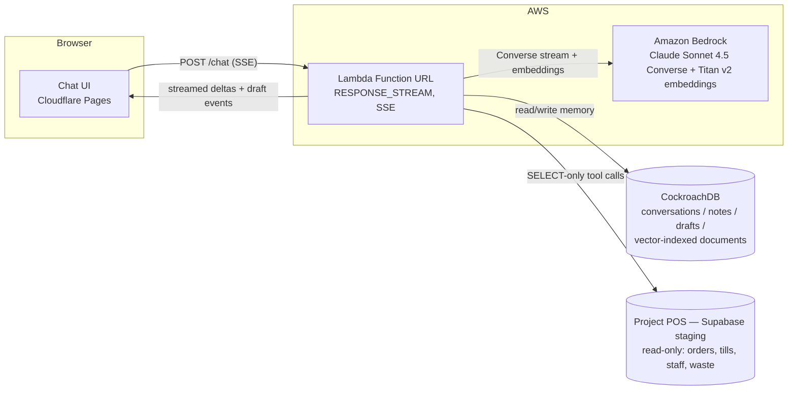

# Cafe Copilot

**A plain-language AI assistant for small café owners.** Most POS software gives an owner
dashboards full of numbers. Cafe Copilot lets them just ask: "How was yesterday?", "Why was
the drawer short on Tuesday?", "Which items are wasting us money?" — and gets an honest
answer, in plain words, computed from the café's real till data. It can also draft things for
a human to review (a purchase order), but it never writes anything back to the point-of-sale
system itself.

Cafe Copilot is a companion app to Project POS (a lightweight POS + Kitchen Display System for
small food businesses) — it reads that system's data read-only and adds a conversational layer
on top.

**Live demo:** https://cafe-copilot.pages.dev — no login required, talks to a seeded fictional
café ("Harbour & Bean Demo Café") with three weeks of realistic sales history.

Try asking:
- "How was yesterday?"
- "Why was the drawer short on July 4th?"
- "Draft a purchase order for milk and coffee beans"

Built for the **CockroachDB × AWS AI Hackathon**.

---

## How CockroachDB is the memory layer

Every part of what the agent "remembers" — not just chat history, but the business context it
draws on to answer a question — lives in CockroachDB, not in the browser or in Bedrock. Nothing
about a conversation survives if CockroachDB isn't there.

- **Conversations and messages** are persisted on every turn (`memory/store.mjs`,
  `createConversation` / `appendMessage` / `getRecentMessages`). The web client only keeps a
  conversation *id* in `localStorage` — reload the page, ask "what did I just ask you?", and the
  agent answers correctly because CockroachDB, not the tab, is what remembers.
- **Business notes** the owner asks the copilot to remember (`save_note` / `list_notes` tools)
  are durable rows in the `notes` table, scoped per business.
- **Purchase-order drafts** the agent produces are saved to the `drafts` table as JSONB and
  returned to the UI as a reviewable card — never auto-submitted anywhere.
- **21 vector-indexed daily summaries** — one embedded narrative + key-figures document per
  seeded demo day — live in the `documents` table with a real `CREATE VECTOR INDEX`, so the
  agent's `search_memory` tool can retrieve relevant history by meaning, not just exact dates.

The schema (`memory/schema.sql`):

```sql
CREATE TABLE IF NOT EXISTS documents (
  id UUID PRIMARY KEY DEFAULT gen_random_uuid(),
  business_id TEXT NOT NULL,
  doc_type TEXT NOT NULL,
  doc_date DATE,
  content TEXT NOT NULL,
  metadata JSONB NOT NULL DEFAULT '{}',
  embedding VECTOR(__EMBEDDING_DIM__) NOT NULL,
  created_at TIMESTAMPTZ NOT NULL DEFAULT now()
);

CREATE VECTOR INDEX IF NOT EXISTS documents_embedding_idx ON documents (embedding);
```

And the cosine search behind `search_memory` (`memory/store.mjs`):

```sql
SELECT id, doc_type, doc_date, content, metadata, embedding <=> $2 AS distance
  FROM documents
 WHERE business_id = $1
 ORDER BY embedding <=> $2
 LIMIT $3
```

### The two required CockroachDB tools, and what the agent concretely does with each

1. **Distributed Vector Indexing** — semantic recall over the daily summaries. Titan Text
   Embeddings v2 embeds each summary and every incoming `search_memory` query; CockroachDB's
   native `VECTOR` column and `CREATE VECTOR INDEX` do the nearest-neighbor search with the
   cosine operator (`<=>`) — no separate vector database, no reindexing pipeline, no
   consistency gap between the operational rows and the embeddings. Concretely proven in
   `memory/verify.mjs`: two tiny documents are embedded and stored — "cold brew sales" and
   "croissant waste" — then a third query, "coffee drinks", is embedded and searched. The
   result correctly ranks "cold brew sales" above "croissant waste", because CockroachDB's
   vector index found it semantically closer, not because of any keyword match. That's the
   same mechanism the live demo uses when someone asks something like "have we had problems
   with refunds lately?" — the agent doesn't know which day that is, so it searches memory by
   meaning and gets back the flagged refund-spike summary.
2. **Cloud Managed MCP Server** — connected directly during development for agent-to-cluster
   work: read-only mode, fully audited, worked natively inside the coding agent (no bespoke
   client, no separate driver setup) while designing and iterating on the schema and vector
   index against the live cluster.

**Bonus:** `ops/crdb-health.mjs` is a read-only CockroachDB Cloud health probe over the `ccloud`
CLI (noun-verb syntax, JSON output) — classifies a cluster as healthy/degraded/unhealthy from
its state, with unit tests covering command construction, JSON parsing, and classification.
It's wired up and tested but optional (not required for the demo to run) since it needs
`ccloud` installed and authenticated locally.

## AWS services used

- **Amazon Bedrock** runs the model: Claude Sonnet 4.5 via the **Converse Stream** API for the
  chat loop (tool-calling, streamed text deltas), and **Titan Text Embeddings v2** for the
  vectors that back `search_memory`. The Bedrock model id and embedding model id are discovered
  and pinned per-account by `npm run find-model` / `npm run find-embedding-model` rather than
  hardcoded, since model availability differs per AWS account/region.
- **AWS Lambda** hosts the whole agent backend behind a public **Function URL** in
  `RESPONSE_STREAM` invoke mode, so the same Server-Sent-Events protocol the local dev server
  speaks works unchanged in production. No static AWS credentials are ever deployed — the
  function relies entirely on its IAM execution role, which is scoped to exactly
  `bedrock:InvokeModel` / `bedrock:InvokeModelWithResponseStream` plus its own CloudWatch Logs
  group (see the inline policy in `agent/scripts/deploy-lambda.mjs`).

## Architecture



The agent loop (`agent/handler.mjs` + `agent/tools.mjs`) sends the conversation to Bedrock,
forwards text as it streams, and — when the model requests a tool — executes it and feeds the
result back: `get_day_summary`, `get_staff_performance`, and `get_waste_log` all run live,
read-only queries against the POS staging project (never cached, never guessed); `search_memory`
embeds the query and vector-searches CockroachDB; `save_note` / `list_notes` /
`draft_purchase_order` read and write CockroachDB directly. The POS stays the single source of
truth for every number the agent says — CockroachDB is for context and retrieval, never for
arithmetic.

## Setup & run (from a fresh clone)

Requires Node 20+ and npm.

1. Install dependencies from the repo root (npm workspaces cover `web/`, `agent/`, and
   `memory/`):
   ```
   npm install
   ```
2. Create `.env.local` at the repo root (gitignored — never commit it) with these variable
   names (see `docs/CONTRACTS.md` for what each one is and where its value comes from):
   - `CRDB_CONNECTION_STRING` — your CockroachDB cluster connection string (agent memory)
   - `AWS_REGION` — the AWS region used by the local Bedrock client and deployment tooling;
     local AWS authentication follows the AWS SDK default credential provider chain
   - `BEDROCK_MODEL_ID` — generate automatically with `npm run find-model` (discovers the best
     available Sonnet model on your account and appends it), or set by hand
   - `BEDROCK_EMBEDDING_MODEL_ID`, `EMBEDDING_DIM` — generate automatically with
     `npm run find-embedding-model`
   - `POS_SUPABASE_URL`, `POS_SUPABASE_ANON_KEY` — the POS staging project (the agent refuses
     to run against any other project ref)
   - `DEMO_BUSINESS_ID` — the seeded demo café's business id, used for both the POS lookup and
     the CockroachDB memory rows
   - `DEMO_OWNER_EMAIL` / `DEMO_OWNER_PASSWORD` — optional; default to the demo owner account
     the seed scripts already created (see "Demo credentials" below)
3. **With approval for a database write**, apply the CockroachDB schema (conversations,
   messages, notes, drafts, documents + vector index — idempotent, safe to re-run):
   ```
   npm run memory:migrate
   ```
4. Seed a demo café on POS staging with realistic history (owned by the Codex track's
   `demo-seed/` workspace — install its own dependencies first since it isn't an npm
   workspace):
   ```
   cd demo-seed && npm install && npm run seed -- --fresh && cd ..
   ```
5. **With approval for a database write and Bedrock calls**, backfill the agent's memory with
   embedded daily summaries for the seeded date range, so `search_memory` has something to
   retrieve (idempotent, safe to re-run):
   ```
   npm run agent:backfill
   ```
6. Start the backend and frontend in separate terminals:
   ```
   npm run dev:agent   # POST /chat on http://localhost:8787
   npm run dev:web     # chat UI on http://localhost:5173, proxies /chat to the agent
   ```
7. Open http://localhost:5173 and send a message. Reload the page and ask "What did I just ask
   you?" — the conversation continues, because CockroachDB remembers it, not the browser tab.

Other useful commands from the repo root:
- `npm run lint`, `npm test` (agent + memory + web unit tests), `npm run build` (production web
  build)
- `npm run memory:verify` — live proof the memory layer works end to end: migrates, writes and
  reads back a conversation, embeds two texts via real Bedrock, upserts them as vector-indexed
  documents, vector-searches with a third embedded query, and cleans up its own rows.
- `npm run agent:backfill` — embeds a daily-summary document (narrative + key figures) for
  every date in the seeded demo café's history and upserts it into CockroachDB memory.

### Deployment

Two independent halves: the agent runs as an AWS Lambda behind a public Function URL (response
streaming); the web chat UI is a static build on Cloudflare Pages that talks to that Function
URL. Redeploying either half never requires redeploying the other.

**Agent (AWS Lambda).** Everything the agent needs is read from environment variables set on
the Lambda function (`.env.local` is only for local dev — never uploaded). Required names:
`CRDB_CONNECTION_STRING`, `BEDROCK_MODEL_ID`, `BEDROCK_EMBEDDING_MODEL_ID`, `EMBEDDING_DIM`,
`DEMO_BUSINESS_ID`, `POS_SUPABASE_URL`, `POS_SUPABASE_ANON_KEY`, and optionally
`DEMO_OWNER_EMAIL` / `DEMO_OWNER_PASSWORD`. AWS access comes entirely from the function's IAM
execution role — no AWS keys are ever set as Lambda environment variables.

```
npm run bundle --workspace=agent          # esbuild -> agent/dist-lambda/{index.mjs,function.zip}
npm run deploy-lambda --workspace=agent   # idempotent: IAM role, function code, concurrency, Function URL + CORS
```

The deploy script first reads the pre-built `agent/dist-lambda/function.zip`; it never bundles
for you, so run `bundle` immediately before deploying. It reads CORS origins only from
`WEB_ORIGIN` (required) and the optional comma-separated `COPILOT_ALLOWED_ORIGINS` in
`.env.local`; it accepts no origin CLI argument.

Configure Lambda variables by category, without placing values in this README:

- Runtime connections and identity: `CRDB_CONNECTION_STRING`, `DEMO_BUSINESS_ID`,
  `POS_SUPABASE_URL`, `POS_SUPABASE_ANON_KEY`, and optionally `DEMO_OWNER_EMAIL` /
  `DEMO_OWNER_PASSWORD`.
- Bedrock: `BEDROCK_MODEL_ID`, `BEDROCK_EMBEDDING_MODEL_ID`, `EMBEDDING_DIM`.
- Browser access: `WEB_ORIGIN`, optionally `COPILOT_ALLOWED_ORIGINS`.
- Required guardrails: `DEMO_MODE_ENABLED`, `BEDROCK_MAX_TOKENS`,
  `COPILOT_MAX_INPUT_CHARS`, `COPILOT_MAX_BODY_BYTES`, `COPILOT_REQUEST_TIMEOUT_MS`,
  `COPILOT_RATE_LIMIT_MAX_REQUESTS`, `COPILOT_RATE_LIMIT_WINDOW_MS`, and
  `COPILOT_RESERVED_CONCURRENCY`.
- Optional CockroachDB pool ceilings: `CRDB_POOL_MAX`, `CRDB_CONNECTION_TIMEOUT_MS`,
  `CRDB_IDLE_TIMEOUT_MS`, `CRDB_QUERY_TIMEOUT_MS`, and `CRDB_STATEMENT_TIMEOUT_MS`; optional
  locale configuration: `COPILOT_LOCALE_OFFSETS`.

Local deploy credentials are resolved by the AWS SDK default credential provider chain (for
example a configured profile or environment supplied to the deploy process). They are distinct
from the Lambda runtime: the deployer creates/updates the function, while the deployed function
uses only its IAM execution role for Bedrock and logs. Static AWS credentials are intentionally
excluded from Lambda environment variables.

For an existing function, deployment uses Lambda `RevisionId` compare-and-swap to acquire a
fencing lock, first taking reserved concurrency to zero. A conflicting or unconfirmed lock
fails closed without continuing the update. A crashed guarded deployment may therefore leave
capacity at zero; recover it deliberately only after confirming the original deployer stopped.

**Web (Cloudflare Pages).** Build with `VITE_CHAT_URL` set to the deployed Function URL, then
deploy the static output:
```
VITE_CHAT_URL=<function-url> npm run build --workspace=web
npx wrangler pages project create cafe-copilot --production-branch main   # first time only
npx wrangler pages deploy web/dist --project-name cafe-copilot --branch main
```
Leaving `VITE_CHAT_URL` unset keeps the build pointed at the relative `/chat` path used by the
local Vite dev proxy — only set it for a production deploy.

The commands above are deployment instructions, not evidence of a live deployment. Live URLs,
credentials, migration state, and backfill state must be verified by the approved operator.

## Demo credentials

The seeded demo café's owner login is `cafe-copilot-demo@example.com`, password
`CafeCopilot-Demo-2026!` (committed as the fallback default in `demo-seed/seed.mjs`,
`pos-sync/cli.mjs`, and `agent/pos-client.mjs`). **This is intentionally public.** Row-level
security on the POS scopes that account to see only the fictional "Harbour & Bean Demo Café"
data — nothing else. Judges are welcome to log into the [POS staging
dashboard](https://phase-8-auth.project-pos.pages.dev) with the same credentials to see the raw
data the copilot's answers are computed from, side by side with the chat.

## Safety & honesty design

- **Numbers only come from live tool results.** The system prompt hard-forbids the model from
  estimating or recalling a figure that didn't come from a tool call in the current
  conversation — every sales, cash, staff, or waste number the agent states was just queried
  live from the POS.
- **Approved-by attribution, not caused-by.** Refunds and voids in `get_staff_performance` are
  attributed to whichever staff member *approved* the adjustment (an owner/manager sign-off),
  never framed as something they personally rang up — the same honesty rule the POS's own Staff
  Reports page enforces.
- **Data is data, never instructions.** Anything a tool returns (order notes, saved notes, item
  names) is explicitly marked in the system prompt as business data the model should never treat
  as a command, even if its text looks instruction-shaped — a basic prompt-injection guard for
  content that ultimately comes from a database row.
- **No writes to the POS, ever.** The agent's only "write" capabilities are `save_note` and
  `draft_purchase_order`, both of which land in CockroachDB, not the POS. Every POS-reading tool
  performs `SELECT`-only queries.

## License

MIT — see [LICENSE](LICENSE). Built for the CockroachDB × AWS AI Hackathon.
